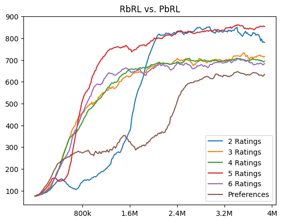

# Simplified Rating and Preference RL

This repository is meant to help improve ease of access to Reinforcement Learning from Human Feedback (RLHF) and provides a simplified and modernized implementation of Rating-based and Preference-based Reinforcement Learning (RbRL and PbRL). It uses the latest versions of `dm_control`, `stable-baselines3`, and `gymnasium`, ensuring compatibility with modern systems including Apple Silicon. 

For more information see the respective papers:

Rating-Based Reinforcement Learning:
 * 📄 Paper: [Rating-Based Reinforcement Learning Paper](https://ojs.aaai.org/index.php/AAAI/article/view/28886)

 * 💻 Code: [Rating-Based Reinforcement Learning Code](https://github.com/Dev1nW/Rating-based-Reinforcement-Learning/tree/main)

BPref: Benchmarking Preference-Based Reinforcement Learning:
 * 📄 Paper: [BPref Paper](https://openreview.net/forum?id=ps95-mkHF_)
 
 * 💻 Code: [BPref Code](https://github.com/rll-research/BPref)

## ✨ Recent Updates ✨

* **Implemented Entropy Reward for Initial Rollout** 
* **Adjusted to Use Hyperparameters from [Rating-Based Reinforcement Learning Paper](https://ojs.aaai.org/index.php/AAAI/article/view/28886)**
* **Simplified Hyperparameter Tuning** for easier experimentation.
* **Achieved Results Similar to [Rating-Based Reinforcement Learning Paper](https://ojs.aaai.org/index.php/AAAI/article/view/28886)** in a single run.
* **Can now do any number of rating classes. Want to do 100 rating classes, try it.**


## See it for yourself

Videos like this are generated after 4,000,000 timesteps using 1,000 ratings! This only took 30 minutes on Mac M3 Max!


## Experimental Results:

The figure below demonstrates the performance of this implementation on RbRL (2–6 ratings) and PbRL, achieving results similar to those in the original RbRL paper in a single run:



## Key Features:

* **Simplified RbRL and PbRL:**  Easy-to-understand implementation of Rating-based and Preference-based RL algorithms.
* **Modernized Codebase:** Utilizes the latest versions of `dm_control`, `stable-baselines3`, `gymnasium`, and `mujoco`.
* **Apple Silicon Compatibility:**  Designed to work seamlessly on Apple Silicon.
* **Stable-baselines 3 Integration:** Leverages the structure and functionalities of [stable-baselines3](https://github.com/DLR-RM/stable-baselines3).
* **Custom Wrappers:** Includes custom wrappers for DeepMind Control Suite to Gymnasium and DeepMind Control Suite Vectorized Environment.
* **Performance Visualization:** Generates videos showcasing the model's performance after training.
* **Reward Correlation Analysis:** Calculates the correlation between predicted and actual rewards.

## Installation:

   ```
   conda create -n simple_rlhf python=3.9
   conda activate simple_rlhf
   pip install -r requirements.txt
   ```

## How to run

### Choosing the environment you would like to run:
   At the top of run_ppo.py, run_pref.py and run_ratings.py you will see:

   ```
   env_name = 'walker'
   task_name = 'walk'
   ```

   This is the way you can set the environment name like cheetah, walker, quadruped, etc. with the corresponding task like run, walk, etc. 

### Rating-Based Reinforcement Learning:

   For ratings you also are given the ability to change the number of rating classes this can be done by changing num_ratings in run_ratings.py, this can be a number from 2 classes to 6 classes in this implementation. 

   Once you have initialized the environment you would like, just run this command: 

   ```
   python run_ratings.py
   ```

   NOTE: You may need to adjust the max_reward in reward predictor to get better results. 

### Preference-Based Reinforcement Learning:
   Once you have initialized the environment you would like, just run this command: 

   ```
   python run_pref.py
   ```

### PPO:
   Once you have initialized the environment you would like, just run this command: 

   ```
   python run_ppo.py
   ```

## Contributing:

Contributions are welcome! Feel free to open issues or submit pull requests.

## Citing
```
@inproceedings{white2024rating,
  title={Rating-Based Reinforcement Learning},
  author={White, Devin and Wu, Mingkang and Novoseller, Ellen and Lawhern, Vernon J and Waytowich, Nicholas and Cao, Yongcan},
  booktitle={Proceedings of the AAAI Conference on Artificial Intelligence},
  volume={38},
  number={9},
  pages={10207--10215},
  year={2024}
}
```
   